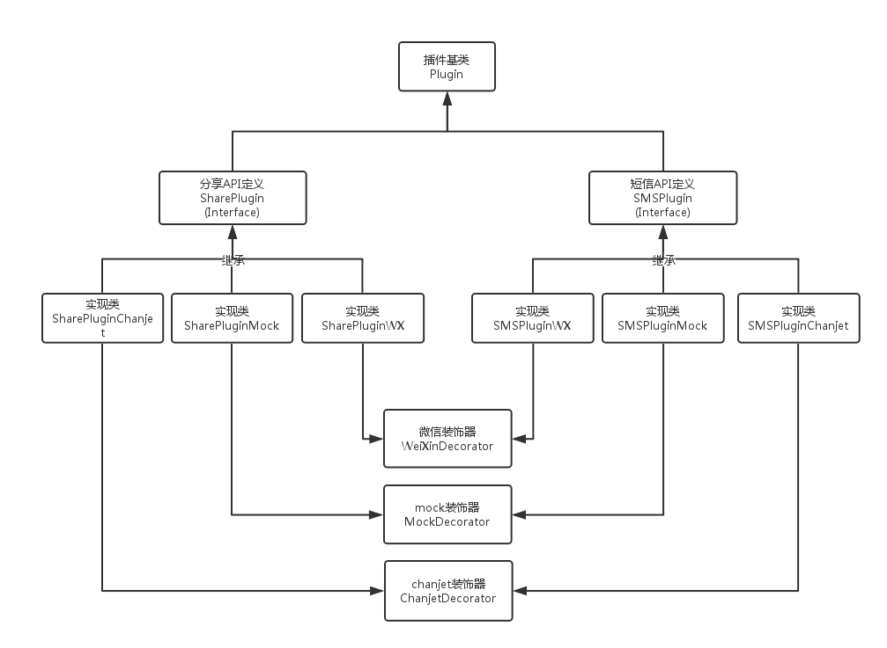
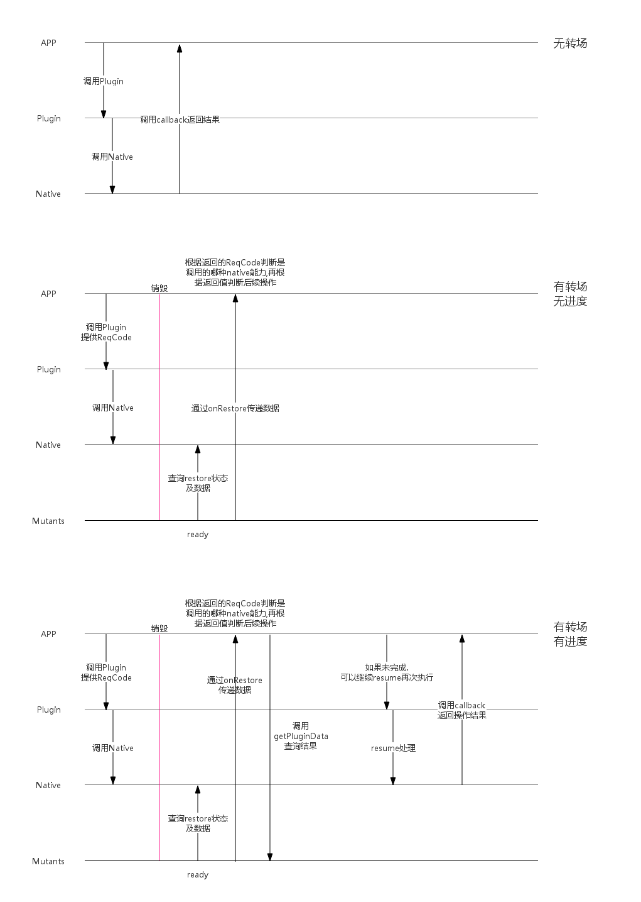

# Chanjet-Plugin

带有 `chanjet-plugin-` 前缀的项目,都是在mutants框架中所提供的nativeAPI的封装类. 在设计时 , 由于考虑到将来可能会支持多平台(微信 , 钉钉等) . 所以设计如下图:





## 定义

### `Plugin` 插件基类

所有插件的基类, 用来描述插件的基本信息.


### `ChanjetDecorator` Chanjet平台装饰器

为插件适配到Chanjet平台上,一些平台相关的通用定义, 保存在这个装饰器中.


### `WeiXinDecorator` 微信装饰器

为插件适配到微信平台上, 微信的插件需要在config中声明所需api , 这些平台特殊处理, 定义在这个装饰器中.


### `MockDecorator` mock装饰器

用于在开发阶段,使用浏览器调试时使用, 返回模拟数据来保证开发和nativeAPI解耦.


### `PluginMocker` mock数据管理对象

为MockDecorator提供统一的mock数据管理. 接受JSONObject格式的mock数据, 其中键为每个插件的id , 值可以自己定义, 基于MockDecorator的实现类, 可以通过this.mockData来获取自己的mock数据.


#### 定义

以 `chanjet-plugin-sms` 为例. 首先定义自己插件的id

``` javascript
import {Plugin} from 'chanjet-plugin-base'

/**
 * 读取短信API基类
 * @author TonyJiang
 */
class SMSPlugin extends Plugin{

    constructor(){
        super();
        this.id = 'SMSPlugin';
    }

}
```


在实现mock类的时候,可以通过this.mockData来获取设置的mock数据

``` javascript
import SMSPlugin from '../interface'
import {MockDecorator} from 'chanjet-plugin-base'

/**
 * 短信插件mock实现类
 * @extends PluginMock,SMSPlugin
 */
@MockDecorator
class SMSPluginMock extends SMSPlugin{
    /**
     * 读取短信接口
     * @param options
     *      @property {TimeStamp} options.startDate 读取开始时间
     *      @property {TimeStamp} options.endDate   读取结束时间
     *      @property {String} options.address 手机号码
     *      @property {String} options.protocol 短信协议 "sms":SMS_PROTO , "mms":MMS_PROTO
     *      @property {String} options.read  是否已读  "unread":未读 , "read":已读
     *      @property {String} options.type  发送类型   "receive": 收到的短信 , "send" 发出的短信
     * @param callback
     */
    read(options , callback) {

        if(this.mockData){
            if (this.mockData.status == 'success') {

                let mock = this.mockData.data.success;
                callback({result: true, data: mock});

            } else {
                callback({result: false});
            }
        }else{
            callback({result : false});
        }


    }

}
```


具体参见 `chanjet-plugin-sms` 的源代码.


#### 示例

首先是mock数据的定义.

``` javascript
// mock.js 定义所有插件mock数据的文件

export default {
  	//id为SMSPlugin的mock数据
    SMSPlugin: {
      	//当前mock的插件状态
        status: "success",
		//每个状态对应的数据
        data: {
          	//成功状态的数据
            success: [
                {
                    "_id": 3333, //短消息序号
                    "thread_id": 0, //对话序号
                    "address": "15926306304", //发件人地址
                    "person": "henry", //发件人 返回一个数字就是联系人列表里的序号，陌生人为null
                    "date": new Date().getTime(), //日期 long
                    "protocol": 0, //协议 0 SMS_RPOTO, 1 MMS_PROTO
                    "read": 1, //是否阅读 0未读， 1已读
                    "status": 0, //状态 -1接收，0 complete, 64 pending, 128 failed
                    "type": 1, //类型 1是接收到的，2是已发出
                    "body": "", //消息内容
                    "service_center": "" //短信服务中心号码编号
                }
            ],
            //失败状态的数据
            error: {}
        }
    },

    //id为SharePlugin的mock数据
    SharePlugin: {
      	//当前mock的插件状态
      	status: "cancel"
    }
}
```


然后是设置mock数据

``` javascript
//引入PluginMocker对象
import {PluginMocker} from 'chanjet-plugin-base'
//引入刚才定义的mock.js
import mockData from 'mock'

//设置mock数据
PluginMocker.data = mockData;
```


# Android-Restore

为了解决安卓下调用插件导致进程被kill掉,在restore时无法获取callback的问题.




插件可以分为上图四种.可以提取出两种属性,分别是 `hasProgress` 和 `hasJump`.

重新定义Plugin

```javascript
class Plugin{

    /**
     * 每个plugin必须有一个唯一标识的ID
     * @type {string}
     */
	id = null;

    /**
     * 每个plugin必须指定对应的实现平台
     * @type {string}
     */
	platform = null;

    constructor(){}

	exec(){}
	

}
```